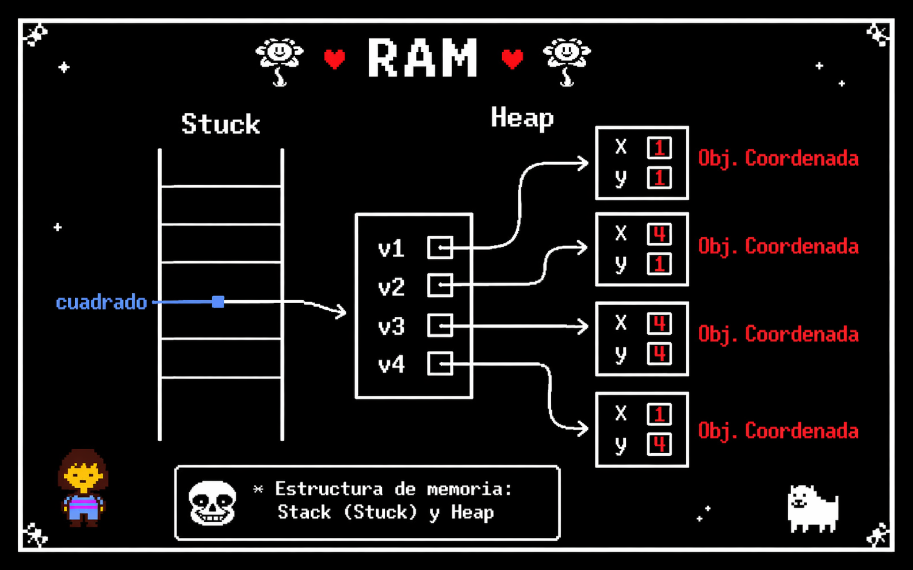

# POO en Python
introduccion a la programacion orientada a objetos (POO) en python

## ¿Por que aprender POO?

- imagina que quieres crear un videojuego tienes herreros , magos guerreros, draganos ... con sus propios puyntos de ataques,vida y habilidades ¿ como los organiso sin repetir todo una y otra ves ? 

- la **programacion orientada a objetos es los (POO)** es la respuesta. en lugar de escribir instrucciones sueltas, modelas el mundo real como *objetos* que tienen caracteristicas y comportamientos. es la forma en la que esta contruidos la mayoria de los programas profecionales del mundo.


## clases y obejos

## Clase de ojeto
 - Una clse es un tipo de dato cullas variables se llaman objetos o instancias.
 - la clse es la definicin del mundo real y los objetos o instancias son elpropio "objeto" del mundo reaas
 - las clases estan compuestas de 2 elementos : - **Atributos** informacion que almasenan la calse
 - **Metodos** operaciones que pueden realisarsen con la clase ## Definicon de una clse en python
```python
class NombreClase:

    def __init__(self, variable1, variable2):
        self.atributo1 = valor 1
        self.atributo2 = valor 2

    def nombreMetodo(self):
        BloqueCodigo
```

- `class` : palabra reservada en python para definir en clase.
- `NombreClase`: nombre de la clase que se quiere crear 
- `def`: palabra resservada en python que se utilisa para definir tanto el constructor de clase(metodo que se ejecute la primera vez que usas en clase) como los diferentes metodos que tiene 
- `__init__`: palabra reservada en python para definir para el metodo constructor de la clase. el metodo `__init__` es lo primero que se ejecuta cuando creas un objeto de una clase
- `(self, variableX)` Parametro del constructor de la clase, el parametro `sef` es obligatorio y despues puede tenertantos parametros como quieras. la forma de añadir parametros es la misma en las funciones
- `self.AtributoX`: forma de utilizacion y acceso a los atributos de la clase.
- `NombreMetodo`: nombre del metodo en clase
- `sef`Parametro del constructor de la clase, el parametro `sef` es obligatorio y despues puede tenertantos parametros como quieras. la forma de añadir parametros es la misma en las funciones
- `BloqueCodigo`: instrucciones que ejecutaran e metodo.

**Al definir una clase tenga en cuenta:**
- puedes definir tantos atributos como nesesites.
- puedes definir tantos metodos como nesesites.
- puedes definir tantos parametros en e constructor y en los metodos como nesesites.

## Ejemplo 1:

- Crear una CLASE que represente a una Persona
- Atributos: nombre, apellidos y edad
- Metodos: mostrar info de la persona

## Codigo 

```python
class Persona:

    # Método constructor
    def __init__(self, nombre, apellidos, edad):
        self.nombre = nombre
        self.apellidos = apellidos
        self.edad = edad

    # Método para mostrar la información
    def mostrar_persona(self):
        print("Nombre:", self.nombre)
        print("Apellidos:", self.apellidos)
        print("Edad:", self.edad)


# Programa principal
def main():
    persona1 = Persona("Johan", "Gil Arias", 18)
    persona1.mostrar_persona()


if __name__ == "__main__":
    main()
```
## compocicion
- consiste en la creacion de nueva clases a partir de otras clases ya existentes que actuan como elementos compositores de la nueva
- las clases existentes seran atributos de la nueva clase

# Reprecentacion de ram y objeto


### ejemplo

- una coordenada en dos direcciones esta compuesta por dos valores , el valor en el eje de las x y el valor en el eje de las Y, esto podria ser una clase .
- un cuadrado esta compuesto por cuatro cordenadas que son los cuatro vertises, esto podria ser una clase que esta compuesta por cuatro clases del odjeto coordenada.

### codigo python
```Python
class Coordenada:
    # Metodo contructor
    def __init__(self, X, Y):
        self.X = x
        self.Y = y

    def mostrarCoordenada(self):
        print("(",self.X,",",self.Y, ")")

class Cuadrado:
    # Metodo contructor
    def __init__(self, v1, v2, v3, v4):
        self.V1 = v1
        self.V2 = v2
        self.V3 = v3
        self.V4 = v4

    def mostrarVertice(self):
        print("el cuadradoesta compuesto por los siguientes vertices:")
        self.V1.mostrarCoordenada()
        self.V2.mostrarCoordenada()
        self.V3.mostrarCoordenada()
        self.V4.mostrarCoordenada()
```
## representacion en ram de la compocicion


## Encapsulacion

- uno de los objetivos que tiene POO es proteger los datos  de acceso o usos no ccontrolados , y esto es lo que se conoce como **encapsulacion**
- los datos (atributos) que compone una clase puede ser de dos tipos:
    - **publico:**los datos son accesibles son control, es decir, los datos pueden ser usados sin ningun tipo de mecanismo que protega ante uso no autorisado o indevido 
    - **Privado:**los datos no son accesibles directamente desde fuera de la clase.
    - Solo pueden ser utilizados o modificados mediante métodos controlados por la propia clase.
    - Esto permite proteger la información ante usos no autorizados o indebidos.
    - Su objetivo es mantener la seguridad e integridad de los datos, evitando cambios accidentales o incorrectos.
    - En la programación orientada a objetos, los atributos privados suelen declararse para que solo la clase tenga acceso a ellos.

## ejemplo 

### codigo python
```Python
class Coordenada:
    # Metodo contructor
    def __init__(self, X, Y):
        self.__X = x
        self.__Y = y

# metodo de acceso

def getX(self):
    return self.__X

def setX(self, X):
    self.__X = x

def getY(self):
    return self.__Y

def setY(self, y):
    self.__Y = y

    def mostrarCoordenada(self):
        print("(",self.__X,",",self.__Y ")")
```
## Herencia
- Permite la reutilización de código.
- Consiste en la definición de una clase utilizando como base una clase ya existente.
- La nueva clase derivada tendrá todas las caracteristicas de la clase base y ampliará el concepto de esta, es decir, tendrá todos los atributos y métodos de la clase base.
- Significa que entre dos clases existe una relación del tipo "es un".
- La herencia en Python se especifica de la siguiente manera: ```class NombreClase(ClaseBase):

# Reprecentacion grafica

```
- Ejemplo:
    - Pensemos en una persona como una clase, la persona tendría una serie de atributos como pueden ser el nombre, los apellidos, la edad, etc.  Esas características de una persona serían compartidas por todas aquellas clases hijas como pueden ser alumno y profesor.  Es decir, alumno y profesor heredarían las propiedades de la clase persona y tendrían sus propias propiedades, diferentes entre ellas, como por ejemplo el curso en el que está el alumno y el horario de tutorias del profesor.

    - Clase base: Persona
        - Atributos:
            - Nombre
            - Apellidos
            - Edad

    - Clase derivada: Alumno
        - Atributos:
            - Curso
            - Asignaturas
    
    - Clase derivada: Profesor
        - Atributos:
            - Antigüedad
            - Tutorias
            - Teléfono
```
```Python 
# Clase Persona

class Persona:
    
    # método constructor
    def __init__(self):
        self.__Nombre = ""
        self.__Apellidos = ""
        self.__Edad = 0

    def getNombre(self):
        return self.__Nombre
    
    def setNombre(self, nombre):
        self.__Nombre = nombre

    def getApellidos(self):
        return self.__Apellidos
    
    def setApellidos(self, apellidos):
        self.__Apellidos = apellidos

    def getEdad(self):
        return self.__Edad
    
    def setEdad(self, edad):
        self.__Edad = edad

    # método para mostrar los datos de una persona
    def MostrarPersona(self):
        print("Nombre: " + self.__Nombre)
        print("Apellidos: " + self.__Apellidos)
        print("Edad: " + str(self.__Edad))

class Alumno(Persona):
    def __init__(self):
        self.__Curso = ""
        self.__Asignaturas = ""
    
    def getCurso(self):
        return self.__Curso
    
    def setCurso(self, curso):
        self.__Curso = curso

    def getAsignaturas(self):
        return self.__Asignaturas
    
    def setAsignaturas(self, asignaturas):
        self.__Asignaturas = asignaturas

    def mostrarAlumno(self):
        print("Alumno")
        print("\tNombre: ", self.getNombre())
        print("\tApellidos: ", self.getApellidos())
        print("\tEdad: ", self.getEdad())
        print("\tCurso: ", self.__Curso)
        print("\tMatrículas: ", self.__Asignaturas)

class Profesor(Persona):
    pass

# metodo principal
def main():
    alumno = Alumno()
    alumno.setNombre("Néstor")
    alumno.setApellidos("Páez Sarmiento")
    alumno.setEdad(25)
    alumno.setCurso("Bachillerato")
    alumno.setAsignaturas(["Matemáticas", "Tecnología", "Inglés"])
    alumno.mostrarAlumno()

if __name__ == "__main__":
    main()
```