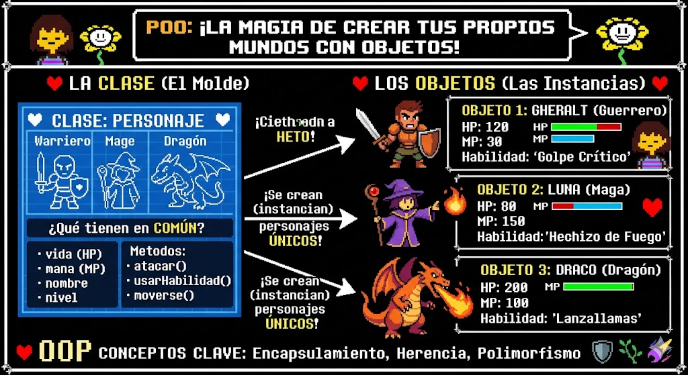

# POO en Python
introduccion a la programacion orientada a objetos (POO) en python

## ¿Por que aprender POO?

- imagina que quieres crear un videojuego tienes herreros , magos guerreros, draganos ... con sus propios puyntos de ataques,vida y habilidades ¿ como los organiso sin repetir todo una y otra ves ? 

- la **programacion orientada a objetos es los (POO)** es la respuesta. en lugar de escribir instrucciones sueltas, modelas el mundo real como *objetos* que tienen caracteristicas y comportamientos. es la forma en la que esta contruidos la mayoria de los programas profecionales del mundo.



## clases y obejos

## Clase de ojeto
 - Una clse es un tipo de dato cullas variables se llaman objetos o instancias.
 - la clse es la definicin del mundo real y los objetos o instancias son elpropio "objeto" del mundo reaas
 - las clases estan compuestas de 2 elementos : - **Atributos** informacion que almasenan la calse
 - **Metodos** operaciones que pueden realisarsen con la clase ## Definicon de una clse en python
```python
class NombreClase:

    def __init__(self, variable1, variable2):
        self.atributo1 = valor 1
        self.atributo2 = valor 2

    def nombreMetodo(self):
        BloqueCodigo
```

- `class` : palabra reservada en python para definir en clase.
- `NombreClase`: nombre de la clase que se quiere crear 
- `def`: palabra resservada en python que se utilisa para definir tanto el constructor de clase(metodo que se ejecute la primera vez que usas en clase) como los diferentes metodos que tiene 
- `__init__`: palabra reservada en python para definir para el metodo constructor de la clase. el metodo `__init__` es lo primero que se ejecuta cuando creas un objeto de una clase
- `(self, variableX)` Parametro del constructor de la clase, el parametro `sef` es obligatorio y despues puede tenertantos parametros como quieras. la forma de añadir parametros es la misma en las funciones
- `self.AtributoX`: forma de utilizacion y acceso a los atributos de la clase.
- `NombreMetodo`: nombre del metodo en clase
- `sef`Parametro del constructor de la clase, el parametro `sef` es obligatorio y despues puede tenertantos parametros como quieras. la forma de añadir parametros es la misma en las funciones
- `BloqueCodigo`: instrucciones que ejecutaran e metodo.

**Al definir una clase tenga en cuenta:**
- puedes definir tantos atributos como nesesites.
- puedes definir tantos metodos como nesesites.
- puedes definir tantos parametros en e constructor y en los metodos como nesesites.